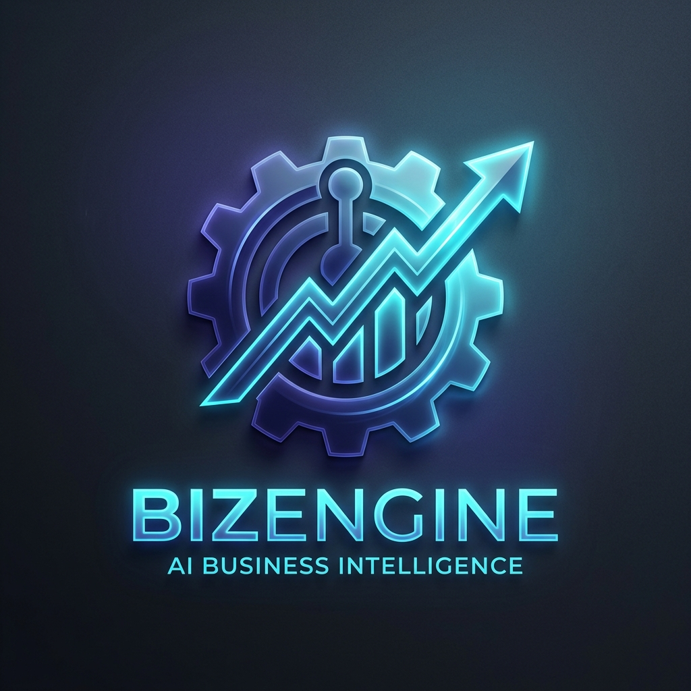

<div align="center">
  
  <h1>🤖 BizEngine | Privacy-First AI Intelligence</h1>
  <p>**Executive-Grade Forensic Suite with Zero-Persistence Architecture**</p>
</div>

---

**BizEngine** is a high-performance, privacy-centric analytical suite designed for secure financial forensics. Unlike traditional dashboards, BizEngine operates on a **Zero-Persistence** model—data is processed entirely in-memory and permanently purged upon session termination, ensuring enterprise-grade data sovereignty.


---

## ✨ Premium Features

### 🛡️ Zero-Persistence & PII Anonymization
Built for the boardroom, BizEngine prioritizes data security above all else.
- **In-Memory Analysis**: Datasets are never written to disk or stored in long-term databases.
- **Auto-Purge**: A "Purge Session" protocol ensures all forensic records are discarded from RAM on logout.
- **PII Scrubbing**: Proprietary filters anonymize Personal Identifiable Information (Emails, Names, IDs) before data is sent for AI inference.

### 🧠 Forensic Intelligence Core
Go beyond generic observations with paired insights and strategic recommendations.
- **Data-Grounded Reasoninig**: Insights are mapped to actual values and percentage contributions.
- **Strategic Recommendations**: Every observation is coupled with a concrete, boardroom-ready action.
- **Executive UI**: Sharp, high-density dashboard with material-dark aesthetics.

### 🔮 Predictive Analytics
Utilizes `scikit-learn` for high-performance monthly revenue forecasting.
- **ML Forecasting**: Integrated Linear Regression model for trend prediction.
- **Model Transparency**: Real-time display of Model Bias, Basis, and R² Confidence scores.

### 💬 BizEngine AI Assistant
A conversational assistant grounded in your specific, anonymized dataset.
- **Contextual Reasoning**: Answers complex business questions using internal data summaries.
- **Sleek UX**: Polished glassmorphism interface with smooth motion interactions.

---

## 🎨 Design System
- **Theme**: "Executive Dark" — utilizing a balanced palette of Deep Indigo, Slate, and Neon Cyan.
- **Visuals**: High-blur (`12px`) glassmorphism layers, mesh-glow backgrounds, and refined 1px borders.

---

## 🛠️ Tech Stack
- **Frontend**: React 19, Vite, Lucide-React, Recharts, Framer-like CSS Transitions.
- **Backend**: Flask (Stateless), Pandas, NumPy, Scikit-learn.
- **Security**: Regex-based PII Scrubber, Session-Isoated MemoryStore.
- **AI/LLM**: Groq (Llama-3), Google Gemini-1.5.

---

## 🚀 Quick Launch

### 1. Backend Setup
```bash
cd backend
python -m venv venv
source venv/bin/activate  # venv\Scripts\activate on Windows
pip install -r requirements.txt
```
Create a `.env` file in the `backend/` folder:
```env
GROQ_API_KEY=your_key_here
GEMINI_API_KEY=your_key_here
SECRET_KEY=generate_using_terminal_command
```

### 2. Frontend Setup
```bash
cd frontend
npm install
npm run dev
```

---

## 👤 Author & Developer
**Dilip Prajapati**  
*Computer Science Student & Full-Stack Developer*

> "BizEngine is a demonstration of secure, AI-powered engineering. I built this to solve the paradox between deep data analysis and enterprise privacy requirements. By utilizing a stateless backend, I've ensured that deep insights don't come at the cost of data security."

- **LinkedIn**: [Dilip Prajapati](https://www.linkedin.com/in/dilip-kohar-014627293)
- **Email**: [dilipkohar4320@gmail.com](mailto:dilipkohar4320@gmail.com)

---

## 📄 License
Copyright (c) 2026 **Dilip Prajapati**. All Rights Reserved.
Distributed for portfolio demonstration. Commercial use requires explicit permission.

---

<div align="center">
  <p>Built for the boardroom by Dilip Prajapati</p>
  <a href="#top">Back to top</a>
</div>
